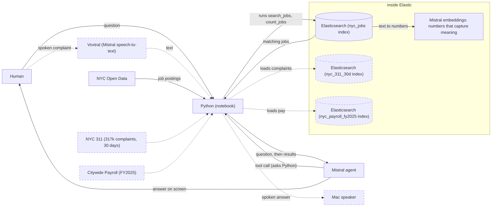

# Creation process: Complain or Get Hired

Solid: works today. Dashed: planned.

## Goal

1. Tell what's wrong on your block.
2. Agent counts agreeing neighbors, names agency.
3. Finds the city job fixing it.
4. Shows posting pay versus real pay.
5. Drafts your first month working there.
6. Stop complaining; start fixing it yourself.

## Stages, each one demoable

- [x] Stage 0: jobs agent works, pushed.
  `.venv/bin/python nyc_jobs_agent.py "city software jobs over 100k"`
- [ ] Stage 1: 311 and payroll loaded.
  `.venv/bin/python nyc_311_ingest.py --check "Rodent"`
  `.venv/bin/python nyc_payroll_ingest.py --check "TEACHER"`
- [ ] Stage 2: agent joins three datasets.
  `.venv/bin/python nyc_jobs_agent.py "rats on my block in Astoria"`
- [ ] Stage 3: voice in, voice out.
  `.venv/bin/python nyc_jobs_voice.py`

1. Each stage: Luis drives, then commit.

## Where we are

`Human -> Python -> Mistral -> Elastic -> Mistral -> screen`

1. Working: jobs; complaints, pay, voice building.

## Log

**2026-10-07**

1. Started free Elastic trial; database online.
2. Redeemed Mistral credits; got secret key.
3. Built sandbox; notebook (sliced script) runs.
4. Saved keys in .env; never committed.
5. Ran smoke_test.py; Elastic 9.6.0, Mistral answered.
6. Lesson: use mistralai.client; old import fails.
7. Building RAG: retrieve, then generate answers.
8. Elastic got 1,384 postings, zero errors.
9. Both Mistral endpoints made inside Elastic.
10. Agent answers; mistral-large-4 picks Elastic queries.
11. Lesson: dates arrive 05-DEC-2026; now converted.
12. Lesson: reasoning_effort none makes answers faster.
13. Ran nyc_jobs_matcher.ipynb; the whole demo works.
14. Wrote quiz_01_foundations.ipynb; quiz teaches the basics.
15. Pivot: neighborhood complaints become job leads.
16. Moved repo to Escobar-Luis/complain-or-get-hired on GitHub.
17. Stage 0 committed; four workers building.

## Demo, 3 minutes

1. Open nyc_jobs_matcher.ipynb; run top to bottom.
2. Show Elastic-only cell: search by meaning.
3. Show counts cell: Elastic tallies jobs.
4. Run ask(); tool-call lines print live.
5. Say: "Elastic finds, Mistral decides, explains."
6. Expect ask() to take 10-20 seconds.
7. Skip ingest main(); data already loaded.

## Use cases for my projects

1. Added only when Luis says so.

## How this file stays current

1. Claude redraws the diagram each iteration.
2. Hook flags code edited after this.
