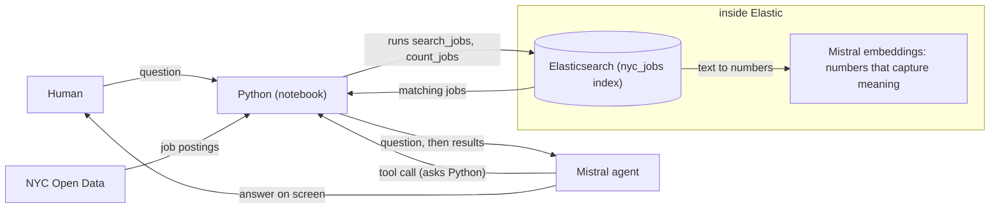

# Creation process

Solid: works today. Dashed: planned.

## Goal

1. Ask city job questions, get answers.
2. Elastic (search database) finds matching jobs.
3. Mistral (AI via Python) explains matches.

## Where we are

`Human -> Python -> Mistral -> Elastic -> Mistral -> screen`

1. Working: whole loop, question to answer.

## Log

**2026-10-07**

1. Started free Elastic trial; database online.
2. Redeemed Mistral credits; got secret key.
3. Built sandbox; notebook (sliced script) runs.
4. Saved keys in .env; never committed.
5. Ran smoke_test.py; Elastic 9.6.0, Mistral answered.
6. Lesson: use mistralai.client; old import fails.
7. Building RAG: retrieve, then generate answers.
8. Elastic got 1,384 postings, zero errors.
9. Both Mistral endpoints made inside Elastic.
10. Agent answers; mistral-large-4 picks Elastic queries.
11. Lesson: dates arrive 05-DEC-2026; now converted.
12. Lesson: reasoning_effort none makes answers faster.
13. Ran nyc_jobs_matcher.ipynb; the whole demo works.
14. Wrote quiz_01_foundations.ipynb; quiz teaches the basics.

## Demo, 3 minutes

1. Open nyc_jobs_matcher.ipynb; run top to bottom.
2. Show Elastic-only cell: search by meaning.
3. Show counts cell: Elastic tallies jobs.
4. Run ask(); tool-call lines print live.
5. Say: "Elastic finds, Mistral decides, explains."
6. Expect ask() to take 10-20 seconds.
7. Skip ingest main(); data already loaded.

## Use cases for my projects

1. Added only when Luis says so.

## How this file stays current

1. Claude redraws the diagram each iteration.
2. Hook flags code edited after this.
